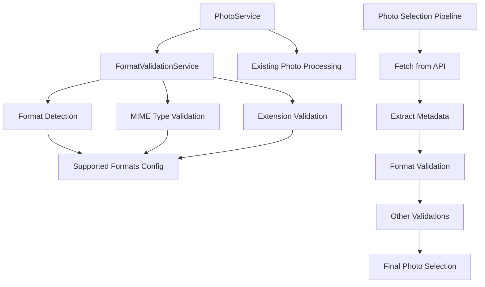

# Design Document

## Overview

The photo format restrictions feature adds validation to ensure only web-compatible image formats are used in the Chronoscape game. This enhancement integrates with the existing PhotoService and adds format validation during the photo selection process, improving reliability and user experience by preventing broken image loads.

## Architecture

### High-Level Architecture



### Integration Points

The format validation will be integrated into the existing photo processing pipeline:

1. **PhotoService.processPhotoData()** - Add format validation before creating Photo objects
2. **PhotoService.filterValidPhotos()** - Include format validation in the filtering criteria
3. **PhotoService.fetchRandomPhotos()** - Enhanced error handling for format-related rejections

## Components and Interfaces

### FormatValidationService

A new service dedicated to image format validation:

```typescript
@Injectable({
  providedIn: 'root'
})
export class FormatValidationService {
  validateImageFormat(url: string, mimeType?: string): Promise<boolean>;
  getSupportedFormats(): string[];
  getFormatFromUrl(url: string): string | null;
  getFormatFromMimeType(mimeType: string): string | null;
  isFormatSupported(format: string): boolean;
}
```

### Enhanced Photo Model

Extend the existing Photo interface to include format information:

```typescript
export interface PhotoMetadata {
  photographer?: string;
  license: string;
  originalSource: string;
  dateCreated: Date;
  format?: string; // New field for detected format
  mimeType?: string; // New field for MIME type
}
```

### Configuration Interface

Define supported formats configuration:

```typescript
export interface FormatConfig {
  supportedFormats: {
    jpeg: {
      extensions: string[];
      mimeTypes: string[];
      enabled: boolean;
    };
    png: {
      extensions: string[];
      mimeTypes: string[];
      enabled: boolean;
    };
    webp: {
      extensions: string[];
      mimeTypes: string[];
      enabled: boolean;
    };
  };
  fallbackBehavior: {
    retryCount: number;
    expandSearchRadius: boolean;
  };
}
```

## Data Models

### Format Validation Result

```typescript
interface FormatValidationResult {
  isValid: boolean;
  detectedFormat?: string;
  detectedMimeType?: string;
  rejectionReason?: string;
  confidence: number; // 0-1 scale
}
```

### Format Detection Strategy

```typescript
interface FormatDetectionStrategy {
  name: string;
  priority: number;
  detect(url: string, metadata?: any): FormatValidationResult;
}
```

## Format Detection Implementation

### Detection Strategies

1. **MIME Type Detection** (Priority: 1)
   - Extract from Wikimedia Commons extmetadata
   - Validate against known MIME types
   - Most reliable method when available

2. **URL Extension Detection** (Priority: 2)
   - Parse file extension from image URL
   - Handle query parameters and fragments
   - Fallback when MIME type unavailable

3. **Content-Type Header Detection** (Priority: 3)
   - HTTP HEAD request to image URL
   - Extract Content-Type header
   - Used for ambiguous cases

### Supported Formats Configuration

```typescript
const SUPPORTED_FORMATS: FormatConfig = {
  supportedFormats: {
    jpeg: {
      extensions: ['.jpg', '.jpeg'],
      mimeTypes: ['image/jpeg'],
      enabled: true
    },
    png: {
      extensions: ['.png'],
      mimeTypes: ['image/png'],
      enabled: true
    },
    webp: {
      extensions: ['.webp'],
      mimeTypes: ['image/webp'],
      enabled: true // Modern browsers support
    }
  },
  fallbackBehavior: {
    retryCount: 3,
    expandSearchRadius: true
  }
};
```

### Rejected Formats

Explicitly rejected formats with reasoning:

```typescript
const REJECTED_FORMATS = {
  tiff: {
    extensions: ['.tiff', '.tif'],
    mimeTypes: ['image/tiff'],
    reason: 'Limited browser support'
  },
  svg: {
    extensions: ['.svg'],
    mimeTypes: ['image/svg+xml'],
    reason: 'Not suitable for photographs'
  },
  gif: {
    extensions: ['.gif'],
    mimeTypes: ['image/gif'],
    reason: 'Avoid animated content'
  },
  bmp: {
    extensions: ['.bmp'],
    mimeTypes: ['image/bmp'],
    reason: 'Large file sizes, limited web optimization'
  }
};
```

## Integration with Existing Services

### PhotoService Modifications

```typescript
// Enhanced processPhotoData method
processPhotoData(rawData: any): Photo | null {
  try {
    // ... existing metadata extraction ...
    
    // Add format validation
    const formatValidation = await this.formatValidationService
      .validateImageFormat(imageInfo.url, extmetadata?.MimeType?.value);
    
    if (!formatValidation.isValid) {
      console.log(`Photo rejected due to format: ${formatValidation.rejectionReason}`, {
        url: imageInfo.url,
        detectedFormat: formatValidation.detectedFormat
      });
      return null;
    }

    // ... create photo object with format metadata ...
    const photo: Photo = {
      // ... existing fields ...
      metadata: {
        // ... existing metadata ...
        format: formatValidation.detectedFormat,
        mimeType: formatValidation.detectedMimeType
      }
    };

    return this.validatePhotoMetadata(photo) ? photo : null;
  } catch (error) {
    console.error('Error processing photo data:', error);
    return null;
  }
}
```

### Enhanced Error Handling

```typescript
// Enhanced fetchRandomPhotos with format-aware retry logic
fetchRandomPhotos(count: number): Observable<Photo[]> {
  return this.fetchPhotosWithRetry(count, 0);
}

private fetchPhotosWithRetry(count: number, retryAttempt: number): Observable<Photo[]> {
  const searchMultiplier = 1 + (retryAttempt * 0.5); // Expand search on retries
  
  return this.performPhotoSearch(count * searchMultiplier)
    .pipe(
      switchMap(photos => {
        if (photos.length >= count) {
          return of(photos.slice(0, count));
        } else if (retryAttempt < this.MAX_RETRY_ATTEMPTS) {
          console.log(`Insufficient photos after format filtering. Retry ${retryAttempt + 1}`);
          return this.fetchPhotosWithRetry(count, retryAttempt + 1);
        } else {
          throw new Error(`Unable to find ${count} photos with acceptable formats`);
        }
      })
    );
}
```

## Error Handling

### Format Validation Errors

1. **Unknown Format Detection**
   - Log warning with photo details
   - Reject photo and continue processing
   - Track rejection statistics

2. **Network Errors During Validation**
   - Implement timeout for HTTP HEAD requests
   - Fallback to extension-based detection
   - Graceful degradation

3. **Insufficient Valid Photos**
   - Retry with expanded search parameters
   - Provide user-friendly error messages
   - Suggest potential solutions

### Error Messages

```typescript
const ERROR_MESSAGES = {
  INSUFFICIENT_PHOTOS: 'Unable to find enough photos in supported formats. Please try again.',
  FORMAT_VALIDATION_FAILED: 'Photo format validation encountered an error.',
  UNSUPPORTED_FORMAT: 'Photo format not supported for web display.',
  NETWORK_ERROR: 'Unable to validate photo format due to network issues.'
};
```

## Performance Considerations

### Caching Strategy

1. **Format Validation Cache**
   - Cache validation results by URL
   - TTL: 1 hour (formats don't change)
   - Reduce redundant HTTP requests

2. **MIME Type Cache**
   - Cache extracted MIME types from metadata
   - Persist across photo fetching sessions
   - Improve subsequent validations

### Optimization Techniques

1. **Batch Validation**
   - Validate multiple photos concurrently
   - Limit concurrent HTTP requests (max 5)
   - Use Promise.allSettled for error resilience

2. **Early Rejection**
   - Check extension first (fastest)
   - Skip HTTP requests when possible
   - Prioritize high-confidence detections

## Testing Strategy

### Unit Testing

1. **FormatValidationService Tests**
   - Test each detection strategy independently
   - Mock HTTP responses for Content-Type detection
   - Validate configuration handling

2. **Integration Tests**
   - Test PhotoService integration
   - Verify error handling and retry logic
   - Test with various photo URL formats

### Test Data

```typescript
const TEST_CASES = {
  validFormats: [
    { url: 'https://example.com/photo.jpg', expected: 'jpeg' },
    { url: 'https://example.com/photo.png', expected: 'png' },
    { url: 'https://example.com/photo.webp', expected: 'webp' }
  ],
  invalidFormats: [
    { url: 'https://example.com/photo.tiff', reason: 'Limited browser support' },
    { url: 'https://example.com/photo.svg', reason: 'Not suitable for photographs' },
    { url: 'https://example.com/photo.gif', reason: 'Avoid animated content' }
  ],
  edgeCases: [
    { url: 'https://example.com/photo.jpg?v=123', expected: 'jpeg' },
    { url: 'https://example.com/photo', mimeType: 'image/png', expected: 'png' },
    { url: 'https://example.com/photo.unknown', expected: null }
  ]
};
```

### Performance Testing

1. **Validation Speed**
   - Measure average validation time per photo
   - Target: <100ms per photo validation
   - Monitor impact on overall photo fetching time

2. **Memory Usage**
   - Monitor cache memory consumption
   - Validate garbage collection of validation results
   - Test with large photo batches

## Security Considerations

### URL Validation

1. **Malicious URL Protection**
   - Validate URL format before HTTP requests
   - Implement request timeouts
   - Sanitize URLs for logging

2. **Content-Type Spoofing**
   - Don't rely solely on HTTP headers
   - Cross-validate with file extensions
   - Log suspicious mismatches

### Privacy Considerations

1. **HTTP Request Minimization**
   - Only make HEAD requests when necessary
   - Respect rate limiting
   - Cache results to reduce requests

## Monitoring and Logging

### Metrics to Track

1. **Format Distribution**
   - Count of photos by detected format
   - Rejection rates by format type
   - Success rates after format filtering

2. **Performance Metrics**
   - Average validation time
   - Cache hit rates
   - Retry attempt frequency

### Logging Strategy

```typescript
interface FormatValidationLog {
  timestamp: Date;
  photoUrl: string;
  detectedFormat?: string;
  validationResult: boolean;
  rejectionReason?: string;
  validationTime: number;
  detectionMethod: string;
}
```

## Accessibility

### Error Communication

1. **Screen Reader Support**
   - Provide descriptive error messages
   - Use ARIA labels for error states
   - Ensure error messages are announced

2. **Visual Indicators**
   - Clear visual feedback for loading states
   - Distinguish between different error types
   - Maintain color contrast standards

## Future Enhancements

### Potential Improvements

1. **Advanced Format Detection**
   - Image signature analysis
   - Machine learning-based format detection
   - Support for emerging formats (AVIF, HEIF)

2. **Dynamic Format Support**
   - Browser capability detection
   - Progressive enhancement for modern formats
   - Fallback format conversion

3. **Performance Optimization**
   - Predictive format validation
   - Background validation for next photos
   - CDN integration for format optimization