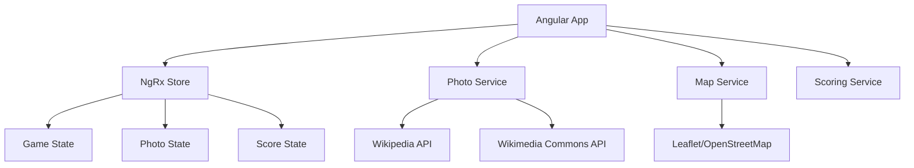

# Design Document

## Overview

The Chronoscape application is a single-page Angular application that presents users with historical photographs and challenges them to guess the year and location. The application uses NgRx for state management, integrates with Wikipedia/Wikimedia Commons APIs for dynamic photo sourcing, and provides an interactive mapping interface for location guessing.

## Architecture

### High-Level Architecture



### State Management Architecture

The application uses NgRx with the following state structure:

```typescript
interface AppState {
  game: GameState;
  photos: PhotoState;
  scoring: ScoringState;
}
```

## Components and Interfaces

### Core Components

#### GameComponent
- Main container component that orchestrates the game flow
- Manages game lifecycle (start, progress, completion)
- Displays current photo and game progress indicators

#### PhotoDisplayComponent
- Renders the current photograph
- Handles photo loading states and error handling
- Provides responsive image display

#### YearGuessComponent
- Input field for year guessing with validation
- Displays year range constraints (1900+)
- Handles form submission and validation

#### MapGuessComponent
- Interactive map using Leaflet with OpenStreetMap tiles
- Pin placement and adjustment functionality
- Zoom and pan controls for precise location selection

#### ResultsComponent
- Shows correct answers vs user guesses
- Displays points earned for each guess
- Provides navigation to next photo or final results

#### ScoreSummaryComponent
- Final score display and breakdown
- Performance categorization
- New game initiation

### Services

#### PhotoService
```typescript
interface PhotoService {
  fetchRandomPhotos(count: number): Observable<Photo[]>;
  validatePhotoMetadata(photo: Photo): boolean;
  processPhotoData(rawData: any): Photo;
}
```

#### MapService
```typescript
interface MapService {
  initializeMap(containerId: string): void;
  addPin(coordinates: Coordinates): void;
  calculateDistance(point1: Coordinates, point2: Coordinates): number;
  setMapView(coordinates: Coordinates, zoom: number): void;
}
```

#### ScoringService
```typescript
interface ScoringService {
  calculateYearScore(guess: number, actual: number): number;
  calculateLocationScore(guessCoords: Coordinates, actualCoords: Coordinates): number;
  getTotalScore(scores: Score[]): number;
}
```

## Data Models

### Photo Model
```typescript
interface Photo {
  id: string;
  url: string;
  title: string;
  description?: string;
  year: number;
  coordinates: Coordinates;
  source: string;
  metadata: PhotoMetadata;
}

interface Coordinates {
  latitude: number;
  longitude: number;
}

interface PhotoMetadata {
  photographer?: string;
  license: string;
  originalSource: string;
  dateCreated: Date;
}
```

### Game State Models
```typescript
interface GameState {
  currentPhotoIndex: number;
  totalPhotos: number;
  gameStatus: GameStatus;
  startTime: Date;
  endTime?: Date;
}

interface PhotoState {
  photos: Photo[];
  currentPhoto: Photo | null;
  loading: boolean;
  error: string | null;
}

interface ScoringState {
  scores: Score[];
  totalScore: number;
  currentGuess: Guess | null;
}

interface Score {
  photoId: string;
  yearScore: number;
  locationScore: number;
  totalScore: number;
}

interface Guess {
  year: number;
  coordinates: Coordinates;
}
```

### NgRx Actions
```typescript
// Game Actions
export const startGame = createAction('[Game] Start Game');
export const nextPhoto = createAction('[Game] Next Photo');
export const endGame = createAction('[Game] End Game');

// Photo Actions
export const loadPhotos = createAction('[Photo] Load Photos');
export const loadPhotosSuccess = createAction('[Photo] Load Photos Success', props<{photos: Photo[]}>());
export const loadPhotosFailure = createAction('[Photo] Load Photos Failure', props<{error: string}>());

// Scoring Actions
export const submitGuess = createAction('[Scoring] Submit Guess', props<{guess: Guess}>());
export const calculateScore = createAction('[Scoring] Calculate Score', props<{photoId: string, guess: Guess}>());
```

## External API Integration

### Wikipedia/Wikimedia Commons Integration

The application integrates with Wikimedia Commons API to source historical photographs:

1. **Photo Discovery**: Query Wikimedia Commons for images with:
   - Date metadata (1900+)
   - Geolocation data
   - Appropriate licensing for reuse

2. **Metadata Extraction**: Parse EXIF data and structured metadata to extract:
   - Creation date/year
   - GPS coordinates
   - Image title and description

3. **Content Filtering**: Ensure photos meet quality and metadata requirements:
   - Minimum resolution standards
   - Valid coordinate data
   - Accurate date information

### API Endpoints Used
- `https://commons.wikimedia.org/w/api.php` - Main API endpoint
- Search parameters: `action=query&list=search&srnamespace=6&srprop=timestamp`
- Image info: `action=query&prop=imageinfo&iiprop=url|metadata|extmetadata`

## Error Handling

### Photo Loading Errors
- Network connectivity issues
- Invalid or missing metadata
- API rate limiting
- Insufficient photos available

### User Input Validation
- Year input validation (1900-current year)
- Map interaction error handling
- Form submission validation

### Graceful Degradation
- Fallback images if API fails
- Offline capability considerations
- Progressive loading with placeholders

## Testing Strategy

### Unit Testing
- **Components**: Test user interactions, input validation, and state changes
- **Services**: Mock API calls and test data transformation logic
- **NgRx**: Test actions, reducers, effects, and selectors
- **Utilities**: Test scoring calculations and coordinate distance functions

### Integration Testing
- API integration with mocked responses
- Component interaction testing
- End-to-end user workflows

### Test Coverage Requirements
- Minimum 80% code coverage
- Critical path testing for scoring logic
- Error scenario testing
- Responsive design testing

### Testing Tools
- Jasmine and Karma for unit tests
- Angular Testing Utilities
- NgRx testing utilities
- Cypress for E2E testing (optional)

## Performance Considerations

### Image Loading
- Lazy loading for photos
- Image compression and optimization
- Preloading next photo in sequence
- Caching strategy for repeated photos

### Map Performance
- Efficient tile loading
- Debounced user interactions
- Memory management for map instances

### State Management
- Selective state updates
- Memoized selectors
- Efficient action dispatching

## Security Considerations

### API Security
- Rate limiting compliance
- Secure API key management (if required)
- Input sanitization for search queries

### Content Security
- Image source validation
- XSS prevention in photo metadata display
- Content Security Policy headers

## Accessibility

### WCAG Compliance
- Keyboard navigation support
- Screen reader compatibility
- High contrast mode support
- Alternative text for images

### Responsive Design
- Mobile-first approach
- Touch-friendly map interactions
- Scalable UI components
- Progressive enhancement